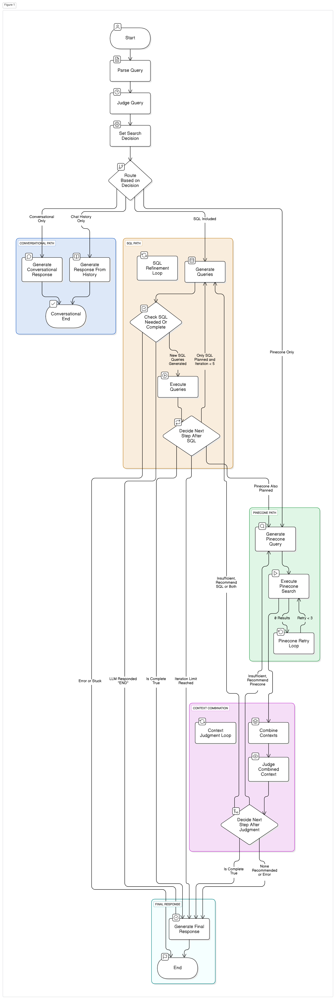

# Restaurant Search Assistant: Hybrid Agentic Pipeline

---

## 🚀 Overview

**Restaurant Search Assistant** is an advanced, agentic, multi-modal search system that allows users to query restaurant and menu data using natural language. It combines:
- **Web Scraping** for data acquisition
- **Knowledge Base Creation** for structured storage
- **Agentic Pipeline** for hybrid SQL + vector search, multi-turn reasoning, and contextual conversation
- **Modern UI** (Streamlit) and API (FastAPI) interfaces

---

## 🧩 Core Problem Solved

Traditional database querying requires users to know specific languages (like SQL) and the exact schema. This pipeline bridges the gap by allowing users to ask questions in natural language. It addresses several challenges:

1. **Hybrid Data Needs:** Queries often require both precise, structured information (prices, ratings - from SQL) and semantic understanding (dish similarity, descriptions - from Vector DB).
2. **Multi-Turn Reasoning:** Answering complex questions might require fetching data in multiple steps, where the result of one step informs the next.
3. **Contextual Understanding:** Users might ask follow-up questions that rely on the context of the ongoing conversation.
4. **Dynamic Strategy:** Different questions require different approaches. The agent needs to intelligently decide whether to use SQL, vector search, chat history, or just a conversational reply.
5. **Information Sufficiency:** The agent needs to assess if the gathered information is enough to answer the query or if further searches are necessary.

---

## 🏗️ Architecture Diagram (Conceptual Flow)

> **Upload your pipeline schematic here:**
> 


**Explanation of Loops:**
- **Loop A (SQL Refinement):** If the strategy involves only SQL and the context judgment determines more *SQL* data is needed, the flow loops back from executing SQL to generating *new* SQL queries based on previous results.
- **Loop B (Context Judgment):** After combining results (from SQL, Pinecone, or both), the `judge_combined_context` node explicitly evaluates sufficiency. If more information is needed, it recommends a method (SQL or Pinecone) and loops back to the respective generation node. This is the main iterative refinement loop.

---

## 🗂️ Key Components

### 1. Web Scraper Component (`src/scraping/zomato_scraper.py`)
- **Purpose:** Scrapes restaurant and menu data from Zomato using Selenium and BeautifulSoup.
- **Usage:**
  - List your target URLs in the script or via input.
  - Run the scraper to output structured JSON data for each restaurant and its menu.

### 2. Knowledge Base Creation (`src/preprocessing/`)
- **JSON to CSV:**
  - `json_to_csv.py` converts raw scraped JSON into a CSV matching the DB schema.
- **CSV to PostgreSQL:**
  - `csv_to_db.py` creates the database schema (see `src/db/schema.sql`) and imports the CSV data into PostgreSQL.
- **Schema:**
  - See [`src/db/schema.sql`](src/db/schema.sql) for the full table and index definitions.

### 3. Agentic Pipeline (`src/pipelines/agentic_openai_pipeline.py`)
- **Orchestrator:** Uses LangGraph's `StateGraph` to manage workflow and state.
- **LLM (OpenAI):**
  - Judges query type, generates SQL/vector queries, evaluates context, and synthesizes final answers.
- **Hybrid Search:**
  - SQL (PostgreSQL) for structured data
  - Pinecone (vector DB) for semantic search
  - Sentence Transformers for embeddings
- **State Management:**
  - All intermediate and final data is tracked in a Pydantic `AgentState` object.
- **Multi-Turn Reasoning:**
  - Handles follow-up questions using chat history.
- **Dynamic Strategy:**
  - LLM decides which search path(s) to use and when to stop/refine.

---

## ⚙️ Setup & Installation

### 1. Prerequisites
- Python 3.9+
- PostgreSQL (with `pg_trgm` extension enabled)
- Pinecone account & API key
- OpenAI API key
- ChromeDriver (for Selenium scraping)

### 2. Clone & Install
```bash
git clone <repository-url>
cd <repository-directory>
pip install -r requirements.txt
```

### 3. Environment Variables
Create a `.env` file in the root directory:
```
OPENAI_API_KEY=your_openai_api_key
PINECONE_API_KEY=your_pinecone_api_key
PINECONE_ENVIRONMENT=your_pinecone_environment
```

### 4. Database Setup
- Edit DB credentials in `src/preprocessing/csv_to_db.py` if needed.
- Run the schema creation and data import:
```bash
python src/preprocessing/csv_to_db.py
```

---

## 🏃 Running the System

### 1. Web Scraper
```bash
python src/scraping/zomato_scraper.py
```

### 2. Knowledge Base Creation
- Convert JSON to CSV:
  ```bash
  python src/preprocessing/json_to_csv.py
  ```
- Import CSV to PostgreSQL:
  ```bash
  python src/preprocessing/csv_to_db.py
  ```

### 3. Agentic Pipeline (CLI)
```bash
python src/pipelines/agentic_openai_pipeline.py "What are the cheapest chicken dishes at KFC?"
```

### 4. Streamlit UI
```bash
streamlit run app.py
```
- Open [http://localhost:8501](http://localhost:8501) in your browser.

### 5. FastAPI Server (Optional)
```bash
uvicorn fastapi_api:app --reload
```
- API endpoint: `POST /api/query`

---

## 🗄️ Database Schema (PostgreSQL)

- I am using Local postgres database, Configure it.
```sql
-- See src/db/schema.sql for full details
CREATE TABLE restaurant_menu_flat (
    item_id SERIAL PRIMARY KEY,
    item_name TEXT,
    item_description TEXT,
    item_price NUMERIC,
    item_category TEXT,
    item_is_veg BOOLEAN,
    restaurant_name TEXT,
    restaurant_address TEXT,
    restaurant_phone_numbers TEXT[],
    restaurant_cuisines TEXT[],
    restaurant_opening_hours JSONB,
    restaurant_dining_rating NUMERIC,
    restaurant_delivery_rating NUMERIC,
    restaurant_dining_ratings_count INTEGER,
    restaurant_delivery_ratings_count INTEGER,
    restaurant_source_url TEXT,
    description_clean TEXT,
    city TEXT,
    created_at TIMESTAMP WITH TIME ZONE,
    updated_at TIMESTAMP WITH TIME ZONE
);
```
- Using Pinecone , Configure the API and also Set index name accordingly (here, nuggetpine)
---

## 🧠 Key Features
- **Hybrid Search:** Combines SQL and Vector DB searches.
- **Multi-step Reasoning:** Can perform multiple queries iteratively.
- **Conversational Context:** Utilizes chat history for follow-up questions.
- **Dynamic Strategy Selection:** Uses an LLM judge to pick the best initial approach.
- **Context Evaluation:** Uses an LLM judge to assess information sufficiency before responding.
- **Iterative Refinement:** Loops back to gather more data if initial results are insufficient.
- **Error Handling:** Includes basic error handling for DB queries and Pinecone retries.
- **Configurable:** Uses environment variables for API keys.

---

## 🛠️ Technologies Used
- Python 3.9+
- Streamlit (UI)
- FastAPI (API)
- LangGraph (workflow orchestration)
- Hugging Face
- Psycopg2 (PostgreSQL connector)
- Pinecone-client (vector DB)
- Sentence-Transformers (embeddings)
- Pydantic (state modeling)
- Dotenv (env management)
- Selenium, BeautifulSoup (scraping)
- OpenAI Python Library (LLM) --- provided for use

---

## 📝 Example Queries
- "What vegetarian items does Burger King offer?"
- "What are the top 5 most expensive chicken dishes?"
- "Find spicy items under $15"
- "Which restaurant has the best delivery rating for pizza?"

---

## 🧩 Potential Improvements
- More sophisticated chat history parsing and context injection
- Adding more tools/APIs (e.g., web search, calculator)
- Making DB schema/parameters configurable via .env
- Implementing more robust error handling and fallback mechanisms
- Cost tracking and optimization for LLM calls
- Allowing the agent to ask clarifying questions to the user
- Replacing hardcoded restaurant lists with dynamic lookups
- Streaming responses for better user experience

---

## 📄 License
[MIT](LICENSE) 
